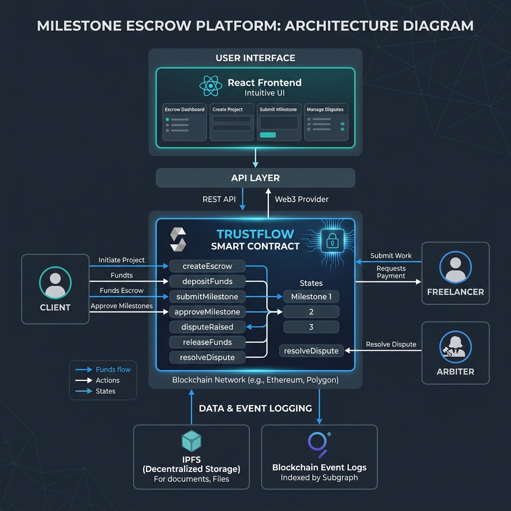

# TrustFlow — Decentralized Milestone Escrow

> A full-stack **trustless freelancer payment platform** built on Ethereum. Clients lock funds in a smart contract and release them incrementally as freelancers complete predefined milestones. Built-in dispute resolution via a neutral arbiter — no centralized intermediary, no 20% platform fee.

---

## Architecture



### Smart Contracts

| Contract | Role |
|---|---|
| `TrustFlow.sol` | Core escrow: creation, milestone management, disputes, refunds |
| `MockUSDT.sol` | ERC-20 test token simulating USDT for local/testnet development |

### Roles

| Role | Permissions |
|---|---|
| **Client** | Creates escrow, approves milestones, raises disputes, claims refund after deadline |
| **Freelancer** | Submits milestones for review, raises disputes |
| **Arbiter** | Resolves disputed escrows, sends remaining funds to winner |

---

## Project Structure

```
milestone-escrow-fullstack/
├── escrow/                         # Hardhat 3 smart contracts
│   ├── contracts/
│   │   ├── TrustFlow.sol           # Core milestone escrow contract
│   │   └── MockUSDT.sol            # Test USDT token
│   ├── test/                       # Mocha + ethers.js tests
│   ├── scripts/                    # Deploy & interaction scripts
│   ├── ignition/                   # Hardhat Ignition modules
│   ├── escrow_strategy.md          # Architecture decision records
│   ├── trustflow_explainer.md      # Detailed design documentation
│   └── hardhat.config.ts
│
└── frontend/                       # React frontend
    ├── src/
    │   ├── components/             # UI components
    │   └── App.js                  # Main app + wallet connection
    ├── public/
    └── package.json
```

---

## How It Works

### Escrow Lifecycle

```
[Client] createEscrowETH(freelancer, arbiter, milestones, deadline)
         └── Locks ETH matching sum of all milestone amounts
                  │
[Freelancer] submitMilestone(escrowId, milestoneIndex)
         └── Marks milestone as "Submitted"
                  │
[Client] approveMilestone(escrowId, milestoneIndex)
         └── Releases milestone.amount → freelancer
         └── If all milestones done → status = Completed
                  │
           ┌──────┴───────┐
    [Dispute raised]    [Deadline passes]
           │                    │
    [Arbiter] resolveDispute()  [Client] refund()
    └── sends remaining         └── returns unreleased
        to winner                    funds to client
```

### Data Structures

```solidity
struct Milestone {
    string title;             // e.g., "Wireframes Complete"
    uint256 amount;           // wei or USDT amount for this milestone
    MilestoneStatus status;   // Pending | Submitted | Approved
}

struct Escrow {
    address client;
    address freelancer;
    address arbiter;
    TokenType tokenType;      // ETH or USDT
    uint256 totalAmount;
    uint256 amountReleased;
    EscrowStatus status;      // Active | Completed | Disputed | Refunded
    uint256 deadline;
    Milestone[] milestones;   // 1 to 10 milestones supported
}
```

### Status State Machine

```
Active ──────────────────────────────────► Completed
  │     (all milestones approved)
  │
  ├──── raiseDispute() ──────────────────► Disputed
  │                                           │
  │                                    resolveDispute()
  │                                           │
  └──── refund() (past deadline) ──────► Refunded ◄──┘
```

---

## Getting Started

### Smart Contracts (Hardhat 3)

```bash
cd escrow

# Install dependencies
npm install

# Compile
npx hardhat compile

# Run tests
npx hardhat test

# Start local node
npx hardhat node

# Deploy locally
npx hardhat ignition deploy ignition/modules/TrustFlowDeploy.ts --network localhost

# Deploy to Sepolia
npx hardhat keystore set SEPOLIA_PRIVATE_KEY
npx hardhat ignition deploy ignition/modules/TrustFlowDeploy.ts --network sepolia
```

### Frontend (React)

```bash
cd frontend

# Install dependencies
npm install

# Set contract addresses in src/config.js
# Start development server
npm start
```

Open [http://localhost:3000](http://localhost:3000) and connect MetaMask.

---

## Key Features

| Feature | Detail |
|---|---|
| ✅ Milestone-based releases | Funds released incrementally per approved milestone |
| ✅ ETH + USDT support | Dual token payment (native ETH or ERC-20 USDT) |
| ✅ Neutral arbiter | Third-party dispute resolution without DAO complexity |
| ✅ Deadline enforcement | Client can claim refund after deadline passes |
| ✅ Reentrancy protection | All fund-moving functions use `nonReentrant` |
| ✅ 1–10 milestones | Flexible milestone count per escrow |
| ✅ Full audit trail | Every action emits detailed events for indexing |
| ✅ Zero platform fees | 100% of funds go to the parties involved |

---

## Test Coverage

Tests cover:
- Escrow creation with ETH and USDT
- Milestone submission and approval flows
- Partial releases and full completion
- Dispute creation and arbiter resolution (freelancer/client winning)
- Refund after deadline
- Access control (only correct roles can call each function)
- Edge cases: wrong ETH amount, bad milestone index, double-approval

---

## Tech Stack

**Smart Contracts**
- **Solidity** `^0.8.28`
- **Hardhat 3 Beta** + Ignition deployment framework
- **OpenZeppelin** v5 (`SafeERC20`, `ReentrancyGuard`)
- **ethers.js** v6 + **TypeScript** + **Mocha**

**Frontend**
- **React** (Create React App)
- **ethers.js** for contract interaction
- **MetaMask** wallet integration

---

## Design Decisions

- **No DAO governance** — Arbiter model chosen for demo clarity and lower complexity, while still providing dispute resolution without trusting a single party
- **Separate ETH/USDT paths** — Avoids WETH wrapping overhead; ETH stays native
- **1–10 milestone cap** — Prevents unbounded storage growth while covering all real use cases
- **`SafeERC20`** — Handles non-standard ERC-20 tokens that return `false` instead of reverting

---

## License

MIT
